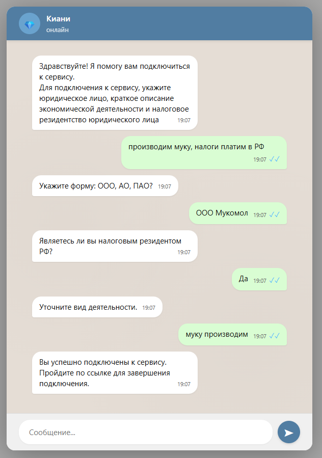
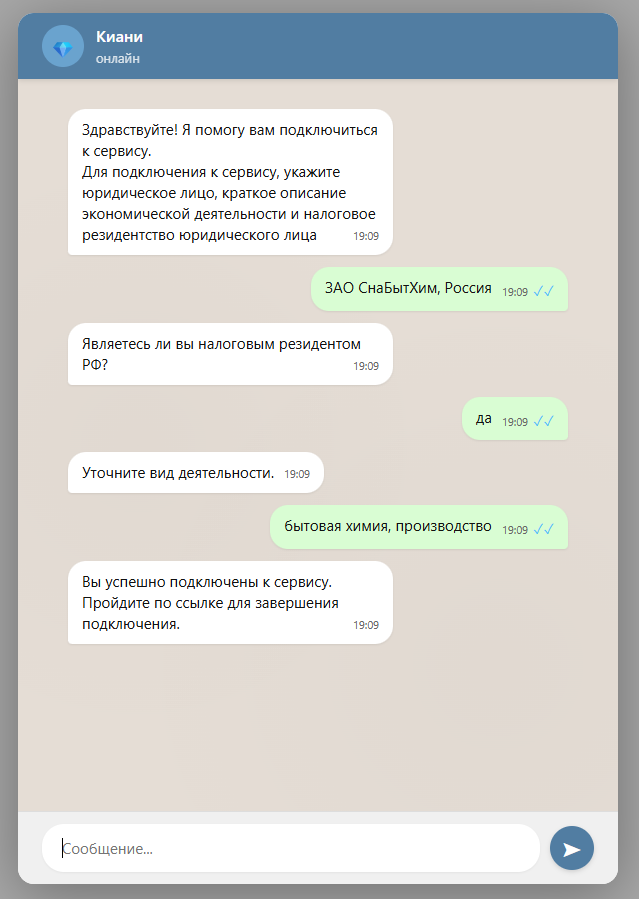
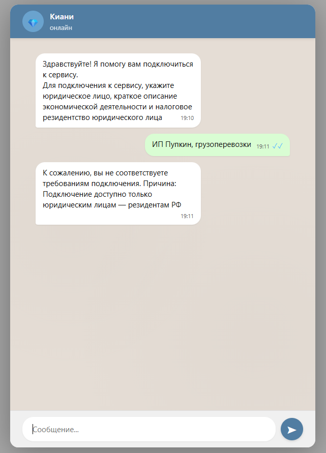

# Система верификации юридических лиц с облачной Яндекс LLM "aliceai-llm-flash"

Система автоматизирует проверку контрагентов по трём критериям (форма собственности, ОКВЭД, налоговый резидент) через диалог с LLM-агентом, снижая время верификации с 30 мин ручной работы до 3-5 минут.

Используется легкая и дешевая модель llm yandex с поддержкой function calling "aliceai-llm-flash" со стоимостью 0.1р за 1000 входящих токенов, без кеша.

---

## Проблема и контекст

Ручная проверка юридических лиц перед подключением к B2B-сервисам требует оператора, который сверяет описание бизнеса и/или коды ОКВЭД с разрешёнными видами деятельности, проверяет статус налогового резидента и принимает решение о подключении или отказе. Это медленно, дорого и не масштабируется.

## Архитектура решения

Решение построено на четырёх компонентах:

1. **ReAct-агент с Function Calling** — управляет диалогом, задаёт уточняющие вопросы, вызывает инструменты проверки и принимает финальное решение.
2. **RAG на классификаторе ОКВЭД** — векторный поиск по нормативным документам даёт агенту актуальный контекст без дообучения модели.
3. **YandexGPT через API** — LLM и эмбеддинги размещаются в Yandex Cloud, что обеспечивает стабильную работу без локальных GPU.
4. **Асинхронный WebSocket-сервер на FastAPI** — неблокирующая обработка сообщений и graceful degradation при нагрузке.

## Ключевые технические решения

LLM склонна галлюцинировать решения. Function Calling решает это: агент вызывает строго типизированные функции, а решение о подключении принимается детерминированным кодом, не моделью.

Для контекста из нормативных документов используется RAG на Chroma с эмбеддингами YandexGPT. Долгие сессии бездействия обрываются автоматическим таймаутом 15 минут с очисткой контекста.

## Инструменты агента (Function Calling)

Агент располагает тремя инструментами:

- `search_description_in_okved(query)` — выполняет RAG-поиск по векторному индексу ОКВЭД-классификатора и возвращает описание вида деятельности с указанием соответствия разрешённым категориям. Проверка легальности по простому признаку наличия описания в ОКВЭД.
- `approve_user()` — финальное решение о подключении пользователя к сервису. Вызывается **только** после явного подтверждения всех трёх критериев верификации.
- `reject_user(reason)` — отказ в подключении с обязательным указанием причины. Вызывается, если хотя бы один критерий не пройден (ИП/физлицо, нерезидент РФ, недопустимый ОКВЭД, попытка инъекции).

**Принцип разделения ответственности:** LLM управляет диалогом и извлекает интенты, но критичные решения (подключить или отказать) принимаются детерминированно. `approve_user` и `reject_user` — точки невозврата, где агент передаёт управление бизнес-логике.

## Поток данных

Пользователь открывает страницу чата в браузере и устанавливает WebSocket-соединение с FastAPI-сервером. При получении сообщения сервер передаёт его в цикл ReAct-агента (LangGraph). Агент формирует запрос к YandexGPT, которая генерирует ответ или запрос на вызов функции.

Если требуется проверка экономической деятельности по ОКВЭД, агент вызывает `search_description_in_okved`, которая обращается к векторному хранилищу Chroma для поиска по классификатору. После сбора всех фактов агент принимает финальное решение через `approve_user` или `reject_user`. Ответ отправляется пользователю через WebSocket. При неактивности 15 минут соединение закрывается с уведомлением.

## Скриншоты работы

### Демо диалога
#### Апрув с уточнением формы ОФП

#### Апрув с уточнение налогового резидентства

#### Реджект индивидуального предпринимателя


## Стек

Python, FastAPI, WebSocket, LangGraph, YandexGPT, YandexGPTEmbeddings, Chroma, Jinja2, asyncio.

## Настройка окружения

1. Укажите credentials Yandex Cloud в `config.py`:
   ```python
   YANDEX_API_KEY = "your-api-key"
   YANDEX_FOLDER_ID = "your-folder-id"